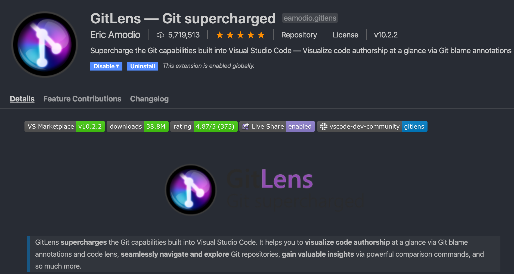
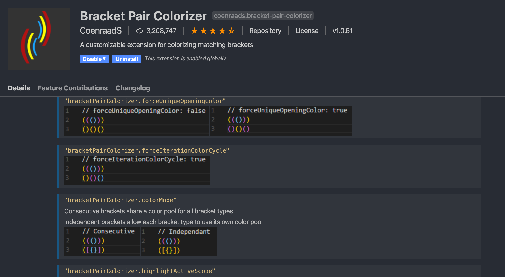
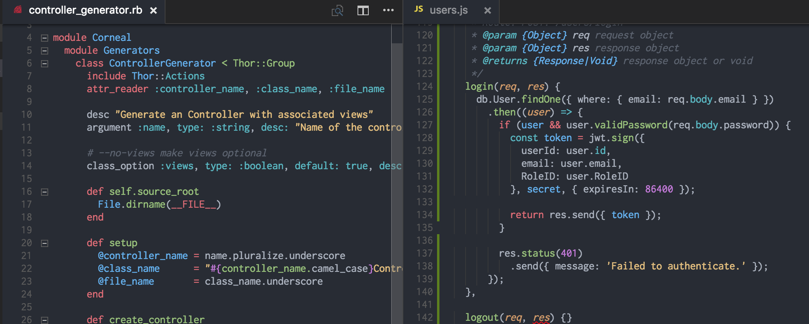

# Supercharge VS Code with Extensions, Tips and Shortcuts

Table of contents:

- [Supercharge VS Code with Extensions, Tips and Shortcuts](#supercharge-vs-code-with-extensions-tips-and-shortcuts)
  - [1. Extensions](#1-extensions)
    - [Core Extensions](#core-extensions)
    - [Additional extensions](#additional-extensions)
  - [2. Icon themes](#2-icon-themes)
  - [3. VSCode themes](#3-vscode-themes)
  - [4. Useful tips and Shortcuts](#4-useful-tips-and-shortcuts)
    - [Shortcuts](#shortcuts)
    - [Tips](#tips)

## 1. Extensions

### Core Extensions

1. Azure Tools
   Most common tools required for interacting with Azure Resources
   

      
   

2. Azure Account
   For common sign-in and subscription management
   

      
   

3. GitLens
   Allows you to see who, why, and how lines of code have changed over time.
   

      
   

4. HashiCorp Terraform
   For terraform syntax highlighting and autocompletion
   

      
   

5. Settings Sync
   To allow you to upload your VS Code settings and sync between different machines. Saves time to reconfigure VS Code everytime you have a new machine.
   

      
   

### Additional extensions

6. TODO Highlight
   Makes TODOs stand out much more. 
   Shift + CMD + P to open palette and type "TODO List highlighted" so you can retrieve all highlighted content.
   By default, "TODO:" and "FIXME:" will be highlighted.
   

      
   

7. Bookmarks
    To add bookmarks to any line of code. Right click on the line and click on "Bookmark: Toggle".
   

      
   

8. Bracket Pair Colorizer
   Gives the opening and closing brackets matching colors, making it much easier to know which brackets belong together.
   

      
   

9. Colorize
   Instantly visualizes CSS colors in your CSS/SASS/Less/... files. This makes it very easy to see at a glance which colors you’re using where.
   

      
   

10. Markdown PDF
    Write it in Markdown, export a PDF as output. Really useful to export or share README files in other format.
    Open the .md file and right-click anywhere inside and choose "Markdown PDF: Export (PDF)" or select other options for exporting in other formats.
    

       
    

## 2. Icon themes

1. vscode-icons has default windows-style folder icons:

   

1. VSCode Great Icons has default macOS-style folder icons:

   

Both will make it easier to differentiate between different files at a glance.

## 3. VSCode themes

 

1. One Dark Pro:

   

 

2. One Dark Theme:

   

 

3. Atom One Light Theme:

   

 

4. Monokai One Dark Vivid:

   

 

5. One Monokai Theme

   

 

## 4. Useful tips and Shortcuts

### Shortcuts

| Command | Description |
| ------- | ----------- |
| `CTRL + /` | Toggle line comment |
| `SHIFT + CTRL + A` | Toggle block comment |
| `CTRL + ` ` | Show/Hide terminal |
| `CTRL + \` | Split editor |
| `CTRL + W` | Close editor in focus |
| `ALT + Click` | Insert cursor |
| `CTRL + ]` | Indent selected text |
| `CTRL + [` | Outdent selected text |
| `CTRL + =` | Zoom in layout |
| `CTRL + -` | Zoom out layout |
| `CTRL + SHIFT + TAB` | Open previous file |

More VSCode windows shortcuts [here](./docs/keyboard-shortcuts-windows.pdf)

### Tips

1. Documenting your code in a markdown file (README.md)? Right click on the file and select 'Open Preview' to see how it looks without even leaving VSCode

2. Use the extension Markdown PDF to convert your markdown file to a pdf and easily share it with anyone.

3. 