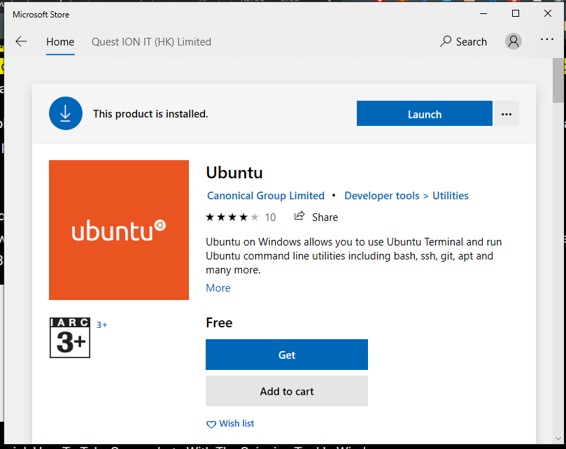

# Installing WSL and ZSH on Windows 10

1. Open Powershell as admin and run the command below:

```Powershell
Enable-WindowsOptionalFeature -Online -FeatureName Microsoft-Windows-Subsystem-Linux
```

2. Press start and go to the Microsoft Store. Search for Ubuntu and install it.

<!--  -->
<p align="center">
   
</p>


1. Open CMD/Powershell and type `ubuntu` (or `wsl`) and press enter to see if it's properly installed. If successfully installed, you should see a bash prompt. You should also be asked to create a username and password. This will be used for your Ubuntu envinronment. Don't add any spaces for username.

2. Run the command below to install ZSH

```Bash
sudo apt-get update # Updates all installed packages and their dependencies
sudo apt-get install zsh #Installs ZSH
```

> NOTE: _APT_ stands for Advanced Package Tool and is the equivalent of Windows Installer

5. Run the command below to install ohmyzsh.

```Bash
git clone https://github.com/robbyrussell/oh-my-zsh.git ~/.oh-my-zsh
```

1. Run the command below to create a zsh config file from the default ohmyzsh template.

```Bash
cp ~/.oh-my-zsh/templates/zshrc.zsh-template ~/.zshrc
```

> Tip: Here's a full [sample](./docs/zshconfig) you can refer to, or use as-is, if you wish.

7. Type `zsh` to load ZSH, and then `source ~/.zshrc` to load the default zsh configuration file.

8. Run `nano ~/.zshrc` to edit the config file in nano editor (CLI text editor) and change the theme/plugins/aliases as required. You can also run `code ~/.zshrc` to edit the config file in VS Code.
   Create your first 2 aliases for editing and reloading the zsh config file:

```Bash
alias editzsh="code ~/.zshrc" #Open config file in VS Code
alias reloadzsh="source ~/.zshrc" #Reloads latest config file in the shell
```

Now the next time you need to edit the config file, just type `editzsh` and if you want to reload the config file, just run `reloadzsh`.

> NOTE: After every change to the zshrc (ZSH Config) file, always run `source ~/.zshrc` to update the shell config.

9. Power up your ZSH!
   Install ZSH Autosuggestions and ZSH Syntax Highlighting to improve productivity.
   Run the following commands to clone the file in the ZSH custom plugin directory.

```Bash
git clone https://github.com/zsh-users/zsh-autosuggestions.git $ZSH_CUSTOM/plugins/zsh-autosuggestions
git clone https://github.com/zsh-users/zsh-syntax-highlighting.git $ZSH_CUSTOM/plugins/zsh-autosuggestions
```

10. After installing the plugins, source them from your zsh config file and reload the config file. Run `editzsh` and then add `zsh-autosuggestions` and `zsh-syntax-highlighting` to the plugins list (approx. line 80), using space separators.

11. Replacing BASH with ZSH as your default Ubuntu shell.
    Open CMD/PS then type `ubuntu` (or `wsl`) to load your WLS environment.
    Run `chsh -s $(which zsh)` to make ZSH the default shell. Close your terminal and try to run `wsl` or `ubuntu` again.

> NOTE: _which_ is a command which will return the path of a binary or alias. Other commands you can explore in [this article](https://www.thegeekstuff.com/2013/04/linux-which-whatis-whereis/)

> TIP: It's more convenient to use `ubuntu` instead of `wsl` so you are CD'ed to home at the first prompt.

---

Additional resources:

## Cool Themes

- Pygmalion
- Robbyrussel
- Bira

## Recommended plugins:

- git
- zsh-autosuggestions
- zsh-syntax-highlighting
- terraform
- autojump

Recommended Aliases:

```Bash
alias zshcfg="nano ~/.zshrc"
alias tfi="terraform init"
alias tfp="terraform plan"
alias tfa="terraform apply"
alias tfd="terraform destroy"
alias repos="cd /home/YOURUSERNAME/repos"
alias reloadzsh="source ~/.zshrc"
alias home="cd ~/"
alias migration="~/repos/migration"
alias qnet-tf="~/repos/qnet-tf"
alias qnet-tf-modules="~/repos/qnet-tf-modules"
alias azurevnet="~/repos/azurevnet"
alias azuretraining="~/repos/azuretraining"
```

- Download themes from [here](https://github.com/ohmyzsh/ohmyzsh/wiki/Themes)
- Download plugins from [here](https://github.com/ohmyzsh/ohmyzsh/wiki/Plugins)
- Get OHMYZSH list of commands/aliases [here](https://github.com/ohmyzsh/ohmyzsh/wiki/Cheatsheet)
