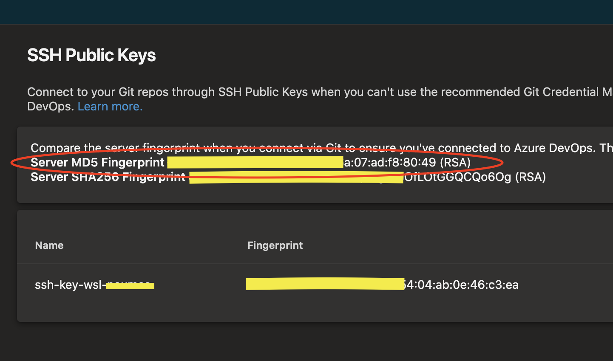
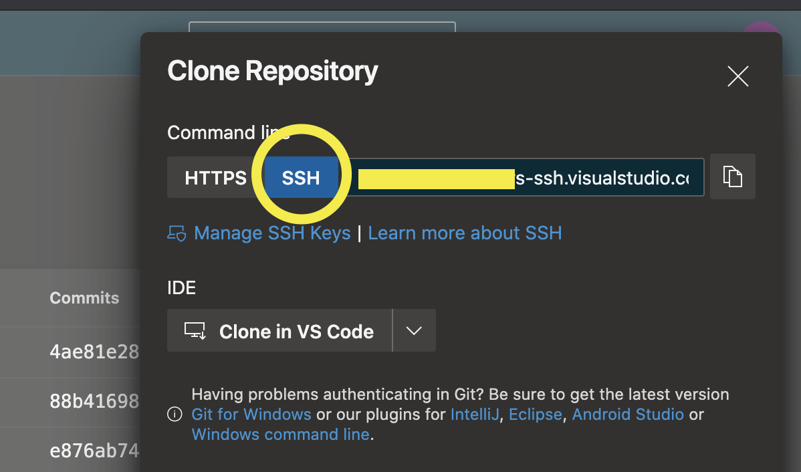

# Getting started with Git and Azure DevOps

The steps below do not yet cover standard executable install of Git for windows. This is because the recommended platform for using Git in our environment is WSL, and Git comes by default with WSL. 

Table of contents:

- [Getting started with Git and Azure DevOps](#getting-started-with-git-and-azure-devops)
  - [Installing Git](#installing-git)
  - [Setup the Git user](#setup-the-git-user)
  - [Setup SSH for Git](#setup-ssh-for-git)

Run `git --version` to confirm if Git is installed. If you see a version number, all is good. If not, follow the steps below to install Git.

=================================
## Installing Git

As always, with linux, we should start out by running general OS and package updates:

Update Os and Packages

`sudo apt-get update`

After you have run the general updates, install Git

Install Git

`apt-get install git-core`

Verify installation

`git --version` 


=================================
## Setup the Git user

```Bash
git config --global user.name "User Name" git config --global user.email "email@address.com"
```

Verify the git config

```Bash
cat ~/.gitconfig
```

=================================
## Setup SSH for Git

1. First check if you already have SSH keys. Run `cd ~/.ssh`, followed by `ls -al` and look for two files called id_rsa and id_rsa.pub. 

2. If you don't already have SSH keys, run `ssh-keygen -t rsa -C "email@address.com"` to create an SSH private and public key. If you do have them, skip to step 5.

3. You will be asked to key in a passphrase to secure your private key. It's strongly recommended to set one to ensure the keys can't be used if an attacker ever gets access to your keys. [READMORE](https://docs.github.com/en/github/authenticating-to-github/working-with-ssh-key-passphrases)

4. Add the SSH key to the SSH agent and key in your passphrase by running:

```zsh
eval $(ssh-agent -s) # Starts the SSH agent
ssh-add ~/.ssh/id2_rsa # Loads a private key from the specified file and saves passphrase
```
For macOS, use:

```zsh
eval $(ssh-agent -s)
ssh-add -K ~/.ssh/id_rsa
```

1. Copy the public key by running `cat ~/.ssh/id_rsa.pub` or open id_rsa.pub with a standard texteditor, and paste it in your DevOps account under [SSH Public Keys](https://dev.azure.com/ORGANIZATION-NAME/_usersSettings/keys)

2. If you have multiple private keys for different services, you specify which service should use which key. To do that, modify the SSH config file accordingly. Here's a [sample](./docs/sshconfig) you can use.

3. Verify that the md5 finger print is the same as the one you see on DevOps:

<p align="center">
   
</p>

```Bash
ssh-keygen -l -E md5 -f ~/.ssh/id_rsa.pub
```

1. Test the connection to DevOps by cloning a repository using the SSH URL from DevOps :

<p align="center">
   
</p>

If you are constantly asked to key in your SSH private key password, you can run the command below to add it to your shell session. This will live in the current session and if you close VSCode or your terminal and re open it, you will need to run it again.
  
`ssh -T email@address.com`
